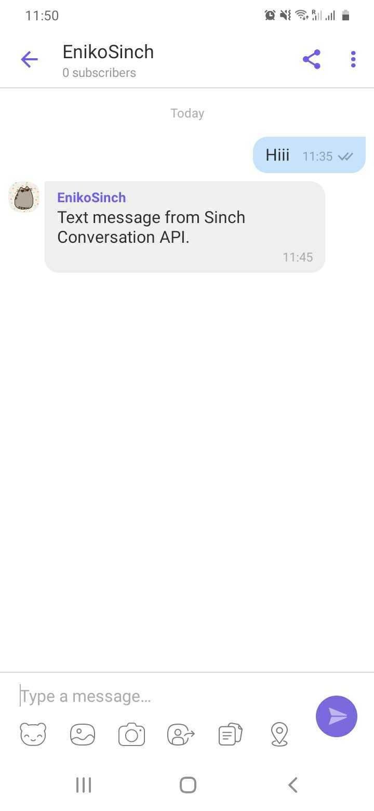
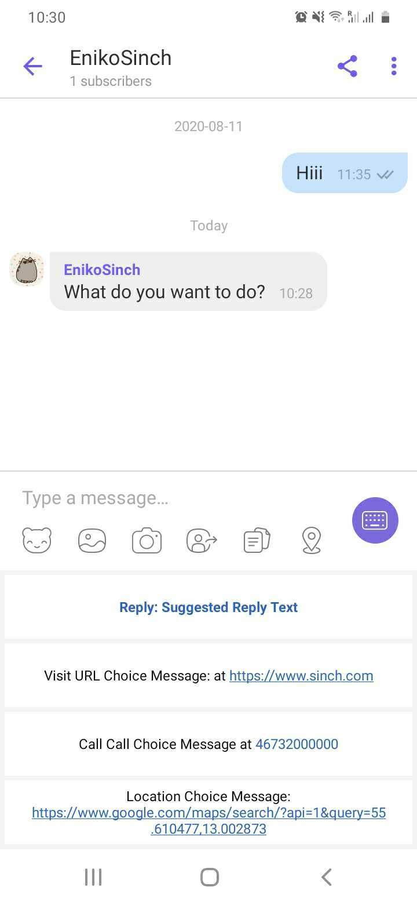
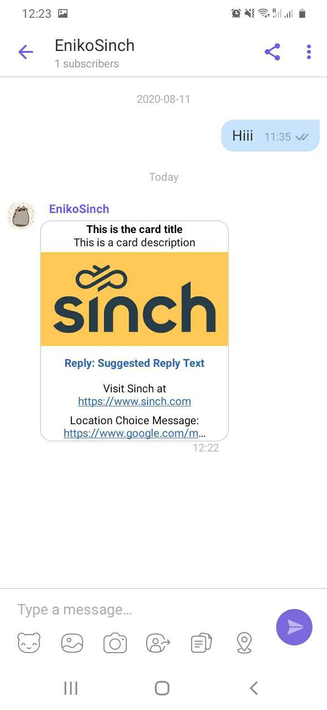
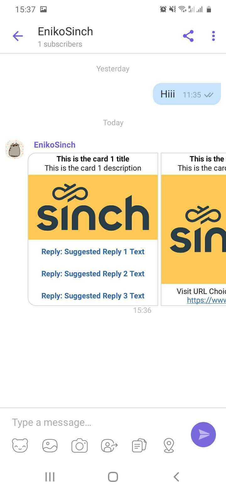
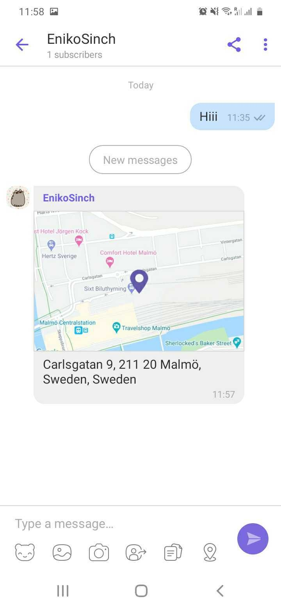

## Conversation API Channel Support <span class="betabadge">Beta</span>

This document gives detailed description of Conversation API channel support.

### Facebook Messenger

Conversation API supports Facebook Messenger and allows sending messages from Facebook Pages.
The page cannot initiate the conversation; it must be started by a contact. To create and configure a
Facebook Page and connect it to Conversation API **app**, follow the instructions below:

- Go to <https://developers.facebook.com/> and log in with your personal/developer account.
- Click on **My Apps** on the top right corner and select **Create App**.
- Fill in the display name for your app and contact Email, then click the **Create App ID** button.
- Once the app is created, you will see a dashboard with various products that you may add to your app.
  Click **Set Up** button inside a box with **Messenger** title.
- Scroll down to the **Access Tokens** section, and click the **Create New Page** button.
- Provide a page name and category, then click the **Create Page** button.
- Go back to the **Messenger Setup** page. Now click **Add or Remove pages** in the **Access Tokens** section.
  Select the previously created page and link it to your app (just **Next**, **Done**, **Ok**).
- You should now see a table row in a table in the **Access Tokens** modal. Click on **Generate Token** for that row.
  Copy this token (from now on referred as **FACEBOOK_PAGE_TOKEN**) and save it somewhere safe.
  This is the access token that you need to specify when setting up a Conversation API **app**.
- Then you need to configure a Messenger integration for your Conversation API **app**.
  The easiest way to do that is to use [Sinch Portal](https://dashboard.sinch.com/convapi/overview).
  Just select your **app** and click on "SET UP CHANNEL" beside the Messenger channel.
  Alternatively you can use the management API and specify the `channel_credentials` for Facebook Messenger
  when creating or updating your app. Example channel configuration is given in the snippet below:

```json
{
  "channel_credentials": [
    {
      "channel": "MESSENGER",
      "static_token": {
        "token": "{{FACEBOOK_PAGE_TOKEN}}"
      }
    }
  ],
  "display_name": "App name"
}
```

- Once you have created Conversation API App, go back to Facebook **Messenger Setup** page, find
  **Webhooks** section (just below **Access Tokens**), click **Add Callback URL** button and fill in with
  the following data (**remember to put region (eu1 or us1) and your Conversation App ID in the callback url**):  
  Callback URL: `https://messenger-adapter.{{REGION}}.conversation-api.prod.sinch.com/adapter/v1/{{CONVERSATION_APP_ID}}/callback`  
  Verify Token: `5651d9fd-5c33-4d7a-aa37-5e3e151c2a92`
- After clicking **Verify and Save**, if no errors occurred, a table in **Webhooks** section will appear,
  with your **Facebook Page** listed within. Click **Add Subscriptions** button, check all boxes and click **save**.
- Now you need to enable **pages_messaging** for your App. Scroll down to the **App review for Messenger**
  section and click **Add to submission** on the **pages_messaging** row.
- Scroll down further and you should see a **Current Submissions** section. You will most likely see
  a little **Additional Information Required** alert notifying you that you need to complete some details before submitting
- Follow the instructions and go to the settings to add the required pieces, which should be:
  - App Icon
  - Privacy Policy URL (for test and development purposes you may use a generator for it)
  - Category
  - Business Use
- This is enough for test and development purposes, you don't have to fill **Details** section nor
  submit it for review. Now you can send messages anyone that has been granted either the Administrator,
  Developer or Tester role for your app.
- Add webhook to your Conversation API **app** using [Sinch Portal](https://dashboard.sinch.com/convapi/overview)
  or the management API. Example snippet for creating webhook programmatically:

```json
{
  "app_id": "{{APP}}",
  "target": "{{WEBHOOK_URL}}",
  "target_type": "HTTP",
  "triggers": [
    "MESSAGE_DELIVERY",
    "EVENT_DELIVERY",
    "MESSAGE_INBOUND",
    "EVENT_INBOUND",
    "CONVERSATION_START",
    "CONVERSATION_STOP",
    "UNSUPPORTED"
  ]
}
```

- And finally, visit your Facebook Page as a user with proper role granted (preferably the one who created the page)
  and try sending a message to it - remember that a user has to start the conversation. If everything works
  fine, you should receive two callbacks, one with `conversation_start_notification`

```json
{
  "app_id": "01E9DQJFPWGZ2T05XTVZAD0BYB",
  "conversation_start_notification": {
    "conversation": {
      "id": "01E9DV2N8C6CK41XFPGQPN0NWE",
      "app_id": "01E9DQJFPWGZ2T05XTVZAD0BYB",
      "contact_id": "01E9DV2N7TYPJ50V0FYC08110D",
      "last_received": "2020-05-28T14:30:48Z",
      "active_channel": "CHANNEL_UNSPECIFIED",
      "active": true,
      "metadata": "",
      "active_channel_senders": []
    }
  }
}
```

- and one with the message you've just sent

```json
{
  "app_id": "01E9DQJFPWGZ2T05XTVZAD0BYB",
  "accepted_time": "2020-05-28T14:30:47.850538Z",
  "message": {
    "id": "01E9DV2N92BMDD034JZ0AQ0VKB",
    "direction": "TO_APP",
    "contact_message": {
      "text_message": {
        "text": "Hello World"
      }
    },
    "channel": "MESSENGER",
    "conversation_id": "01E9DV2N8C6CK41XFPGQPN0NWE",
    "contact_id": "01E9DV2N7TYPJ50V0FYC08110D",
    "metadata": "",
    "accept_time": "2020-05-28T14:30:47.841429Z"
  }
}
```

- Now, with a conversation created automatically, you can use received **contact_id** to send a response
  for this user:

```json
{
  "app_id": "{{APP_ID}}",
  "recipient": {
    "contact_id": "{{CONTACT_ID}}"
  },
  "message": {
    "text_message": {
      "text": "Text message from Sinch Conversation API."
    }
  },
  "channel_priority_order": ["MESSENGER"]
}
```

- You should receive callbacks with information that message has been delivered and read. The channel is now configured.

#### Rich Message Support

This section provides detailed information about which rich messages are
natively supported by Facebook Messenger channel and what transcoding is applied in
other cases.

##### Sending Messages

Here we give a mapping between Conversation API generic message format
and the Messenger rendering on mobile devices.
Please note that for the sake of brevity the JSON snippets do not include
the **recipient** and **app_id** which are both required when sending a message.

###### Text Messages

---

Conversation API POST `messages:send`

```json
{
  "message": {
    "text_message": {
      "text": "Text message from Sinch Conversation API."
    }
  }
}
```

The rendered message:


###### Media Messages

---

Conversation API POST `messages:send`

```json
{
  "message": {
    "media_message": {
      "url": "https://1vxc0v12qhrm1e72gq1mmxkf-wpengine.netdna-ssl.com/wp-content/uploads/2018/12/favicon.png"
    }
  }
}
```

The rendered message:


###### Choice Messages

---

Conversation API POST `messages:send`

```json
{
  "message": {
    "choice_message": {
      "text_message": {
        "text": "What do you want to do?"
      },
      "choices": [
        {
          "text_message": {
            "text": "Suggested Reply Text"
          }
        },
        {
          "url_message": {
            "title": "URL Choice Message:",
            "url": "https://www.sinch.com"
          }
        },
        {
          "call_message": {
            "title": "Call Choice Message:Q",
            "phone_number": "46732000000"
          }
        },
        {
          "location_message": {
            "title": "Location Choice Message",
            "label": "Enriching Engagement",
            "coordinates": {
              "latitude": 55.610479,
              "longitude": 13.002873
            }
          }
        }
      ]
    }
  }
}
```

The rendered message:


###### Card Messages

---

Conversation API POST `messages:send`

```json
{
  "message": {
    "card_message": {
      "title": "This is the card title",
      "description": "This is the card description",
      "media_message": {
        "url": "https://1vxc0v12qhrm1e72gq1mmxkf-wpengine.netdna-ssl.com/wp-content/uploads/2019/05/Sinch-logo-Events.png"
      },
      "choices": [
        {
          "text_message": {
            "text": "Suggested Reply Text"
          }
        },
        {
          "url_message": {
            "title": "URL Choice Message:",
            "url": "https://www.sinch.com"
          }
        },
        {
          "call_message": {
            "title": "Call Choice Message:Q",
            "phone_number": "46732000000"
          }
        },
        {
          "location_message": {
            "title": "Location Choice Message",
            "label": "Enriching Engagement",
            "coordinates": {
              "latitude": 55.610479,
              "longitude": 13.002873
            }
          }
        }
      ]
    }
  }
}
```

The rendered message:


###### Carousel Messages

---

Conversation API POST `messages:send`

```json
{
  "message": {
    "carousel_message": {
      "cards": [
        {
          "title": "This is the card 1 title",
          "description": "This is the card 1 description",
          "media_message": {
            "url": "https://1vxc0v12qhrm1e72gq1mmxkf-wpengine.netdna-ssl.com/wp-content/uploads/2019/05/Sinch-logo-Events.png"
          },
          "choices": [
            {
              "text_message": {
                "text": "Suggested Reply 1 Text"
              }
            },
            {
              "text_message": {
                "text": "Suggested Reply 2 Text"
              }
            },
            {
              "text_message": {
                "text": "Suggested Reply 3 Text"
              }
            }
          ]
        },
        {
          "title": "This is the card 2 title",
          "description": "This is the card 2 description",
          "media_message": {
            "url": "https://1vxc0v12qhrm1e72gq1mmxkf-wpengine.netdna-ssl.com/wp-content/uploads/2019/05/Sinch-logo-Events.png"
          },
          "choices": [
            {
              "url_message": {
                "title": "URL Choice Message:",
                "url": "https://www.sinch.com"
              }
            }
          ]
        },
        {
          "title": "This is the card 3 title",
          "description": "This is the card 3 description",
          "media_message": {
            "url": "https://1vxc0v12qhrm1e72gq1mmxkf-wpengine.netdna-ssl.com/wp-content/uploads/2019/05/Sinch-logo-Events.png"
          },
          "choices": [
            {
              "call_message": {
                "title": "Call Choice Message:Q",
                "phone_number": "46732000000"
              }
            }
          ]
        },
        {
          "title": "This is the card 4 title",
          "description": "This is the card 4 description",
          "media_message": {
            "url": "https://1vxc0v12qhrm1e72gq1mmxkf-wpengine.netdna-ssl.com/wp-content/uploads/2019/05/Sinch-logo-Events.png"
          },
          "choices": [
            {
              "location_message": {
                "title": "Location Choice Message",
                "label": "Enriching Engagement",
                "coordinates": {
                  "latitude": 55.610479,
                  "longitude": 13.002873
                }
              }
            }
          ]
        }
      ]
    }
  }
}
```

The rendered message:


###### Location Messages

---

Conversation API POST `messages:send`

```json
{
  "message": {
    "location_message": {
      "title": "Location Message",
      "label": "Enriching Engagement",
      "coordinates": {
        "latitude": 55.610479,
        "longitude": 13.002873
      }
    }
  }
}
```

The rendered message:


### WhatsApp

Conversation API provides support for WhatsApp channel through Sinch WhatsApp Business Messaging API.
To start using WhatsApp through Conversation API you need to first have a Sinch WhatsApp bot -
[read more](https://developers.sinch.com/docs/whatsapp-introduction).

#### Channel Configuration

The easiest way to configure your Conversation API **app** with WhatsApp support is to use
[Sinch Portal](https://dashboard.sinch.com/convapi/overview). Just select your **app** and
click on "SET UP CHANNEL" beside the WhatsApp channel.

##### Setup WhatsApp integration using the API

Sending a WhatsApp message requires a Conversation API **app** with
`channel_credentials` for WHATSAPP channel. Example, **app** is given in the
following snippet:

```json
{
    "channel_credentials": [
        {
            "channel": "WHATSAPP",
            "static_bearer": {
                "claimed_identity": "{{WHATSAPP_BOT_ID}}",
                "token": "{{WHATSAPP_BEARER_TOKEN}}"
            }
        }
    ]
}
```

You need to replace `{{WHATSAPP_BOT_ID}}` with your Sinch WhatsApp bot ID and
`{{WHATSAPP_BEARER_TOKEN}}` with the bot's access token.

Receiving contact messages (replies) and delivery receipts
from WhatsApp requires setting the Callback URL of the WhatsApp bot to
point to your Conversation API **app**. This step is done automatically if the
integration is enabled from the [Sinch Portal](https://dashboard.sinch.com/convapi/overview).
The URL is the following:

```
https://whatsapp-adapter.{{REGION}}.conversation-api.int.prod.sinch.com/adapter/v1/{{CONVERSATION_APP_ID}}/callback
```

Where {{REGION}} is one of `eu1` or `us1` and must match the region of your **app** while
{{CONVERSATION_APP_ID}} is the id of your Conversation API **app**.

Do not forget that for receiving messages you also need to configure at least one Conversation API webhook which will trigger POST callbacks to the given URL. The most important triggers for your conversation applications are:

- MESSAGE_DELIVERY - delivery receipts for business messages
- MESSAGE_INBOUND - inbound messages e.g., contact replies

#### Rich Message Support

Conversation API supports all capabilities of WhatsApp API: rich template messages,
media and location messages.

##### Sending Messages

All business initiated conversations on the WhatsApp channel must start with an “Opt-In” by the user.
This can be collected through any third party channel. For example in an SMS message, a web form, email etc.
You need to register the collected user opt-in by invoking the opt-in service
provided by Conversation API - `/optins:register`. A successful registration or opt-in errors will be
announced by a callback to webhooks with trigger `OPT_IN`.

Businesses must also provide a method by which customers may opt-out of receiving future messages from your organization.
Registering the user opt-out is done through the Conversation API `/optouts:register` endpoint.
The outcome of the opt-out registration is delivered by a callback to webhooks with trigger `OPT_OUT`.

An example payload for opt-in/out registration (POST to `/optins:register` or `/optouts:register`) is the following snipped:

```json
{
    "app_id": "{{APP_ID}}",
    "recipient": {
        "contact_id": "{{CONTACT_ID}}"
    },
    "channels": ["WHATSAPP"]
}
```

where {{APP_ID}} is the ID of your **app** and the {{CONTACT_ID}} is the contact with WhatsApp channel identity
for which this opt-in/out is preformed.

The rest of this section provides examples of various messaging capabilities of WhatsApp channel,
and how to utilize them using Conversation API generic message format.
Please note that for the sake of brevity the JSON snippets do not include
the **recipient** and **app_id** which are both required when sending a message.

###### Template messages

Sending a message outside of the customer care session requires an approved template
([read more](https://developers.sinch.com/docs/whatsapp-introduction)).
You need to specify the template name, language code, and the set of parameters
defined in the template. Conversation API provides capability to send
channel-specific templates that use a key-value dictionary to
specify the template parameters. Each key in the dictionary corresponds to
a property of a template parameter as they are defined in WhatsApp public
documentation for [media](https://developers.facebook.com/docs/whatsapp/api/messages/message-templates/media-message-templates)
and [interactive](https://developers.facebook.com/docs/whatsapp/api/messages/message-templates/interactive-message-templates)
templates.

The format of the keys in the parameter dictionary is of the following form:
```
<component_type>[<component_index>]<component_sub_type>[<parameter_index>]<parameter_field>
```

where:

- *component_type* is one of header, body or button.
- *component_index* is a 0-based index of the button in the template. There are at most 3 buttons. *component_index* is present and required only for button component.
- *component_sub_type* is present and required only for button component. It is one of quick_reply or url.
- *parameter_index* is a 1-based index of the parameter for the given component.
- *parameter_field* is a property of the parameter. It can be one of text, payload, document.*, image.* or video.*

---

**Text Template**

Below is an example of sending a text-only template with three body parameters i.e., no header.
The template name is *text_template* and it is available for *en* language code.

Conversation API POST `messages:send`

```json
{
    "message": {
        "template_message": {
            "channel_template": {
                "WHATSAPP": {
                    "template_id": "text_template",
                    "language_code": "en",
                    "parameters": {
                        "body[1]text": "Value of first parameter",
                        "body[2]text": "Value of second parameter",
                        "body[3]text": "Value of third parameter"
                    }
                }
            }
        }
    }
}
```

Sending the same template for *fr* language code which also include a text header parameter will be:

```json
{
    "message": {
        "template_message": {
            "channel_template": {
                "WHATSAPP": {
                    "template_id": "text_template",
                    "language_code": "fr",
                    "parameters": {
                        "header[1]text": "Value of header parameter",
                        "body[1]text": "Value of first parameter",
                        "body[2]text": "Value of second parameter",
                        "body[3]text": "Value of third parameter"
                    }
                }
            }
        }
    }
}
```

---

**Media Template**

WhatsApp allows sending media (document, video, image) in the template header.

**Document**

The parameter fields are:

| Parameter field key             | Description                               | Required? |
| ------------------------------- | ----------------------------------------- | --------- |
| header[1]document.link          | The URL of the document                   | Yes       |
| header[1]document.provider.name | Provider to use when downloading the file | No        |
| header[1]document.filename      | The filename of the document              | No        |

Below is an example of sending a template with a document header and a single body parameter.
The template name is *document_template* available for *en* language code.

Conversation API POST `messages:send`

```json
{
    "message": {
        "template_message": {
            "channel_template": {
                "WHATSAPP": {
                    "template_id": "document_template",
                    "language_code": "en",
                    "parameters": {
                        "header[1]document.link": "https://example.com",
                        "header[1]document.filename": "document.pdf",
                        "body[1]text": "Value of first parameter"
                    }
                }
            }
        }
    }
}
```

**Video**

The parameter fields are:

| Parameter field key             | Description                               | Required? |
| ------------------------------- | ----------------------------------------- | --------- |
| header[1]video.link             | The URL of the video                      | Yes       |
| header[1]video.provider.name    | Provider to use when downloading the file | No        |

Below is an example of sending a template with a video header and a single body parameter.
The template name is *video_template* available for *en* language code.

Conversation API POST `messages:send`

```json
{
    "message": {
        "template_message": {
            "channel_template": {
                "WHATSAPP": {
                    "template_id": "video_template",
                    "language_code": "en",
                    "parameters": {
                        "header[1]video.link": "https://example.com",
                        "body[1]text": "Value of first parameter"
                    }
                }
            }
        }
    }
}
```

**Image**

The parameter fields are:

| Parameter field key             | Description                               | Required? |
| ------------------------------- | ----------------------------------------- | --------- |
| header[1]image.link             | The URL of the image                      | Yes       |
| header[1]image.provider.name    | Provider to use when downloading the file | No        |

Below is an example of sending a template with an image header and a single body parameter.
The template name is *image_template* available for *en* language code.

Conversation API POST `messages:send`

```json
{
    "message": {
        "template_message": {
            "channel_template": {
                "WHATSAPP": {
                    "template_id": "image_template",
                    "language_code": "en",
                    "parameters": {
                        "header[1]image.link": "https://example.com",
                        "body[1]text": "Value of first parameter"
                    }
                }
            }
        }
    }
}
```

---

**Interactive Template**

WhatsApp allows sending interactive templates with up to three buttons.

The parameter fields used to configure the buttons in the template are:

| Parameter field key             | Description                               | Required?                                         |
| ------------------------------- | ----------------------------------------- | ------------------------------------------------- |
| button[n]url[1]text             | Dynamic URL suffix for the URL button     | Yes, if button at index *n* is URL button         |
| button[m]quick_reply[1]payload  | Postback payload to be returned           | Yes, if button at index *m* is quick_reply button |

where *n* and *m* are indices of the buttons in the template.
The quick_reply payload field must be set even when empty. For example for quick_reply button
at index 0 this can be done by adding the following entry in the parameter dictionary:

 ```
    "button[0]quick_reply[1]payload": ""
 ```

Below is an example of sending a template with a quick reply button at index 0 and two
URL buttons at index 1 and 2 respectively. The template have also one header and one body
parameters. The template name is *interactive_template* available for *en* language code.

Conversation API POST `messages:send`

```json
{
    "message": {
        "template_message": {
            "channel_template": {
                "WHATSAPP": {
                    "template_id": "interactive_template",
                    "language_code": "en",
                    "parameters": {
                        "header[1]text": "Value of header parameter",
                        "body[1]text": "Value of first parameter",
                        "button[0]quick_reply[1]payload": "Value of quick reply postback button 0",
                        "button[1]url[1]text": "Value for URL suffix button 1",
                        "button[2]url[1]text": "Value for URL suffix button 2"
                    }
                }
            }
        }
    }
}
```

###### Text Messages

Given a customer care session has started sending a text message with WhatsApp is done as follow:

---

Conversation API POST `messages:send`

```json
{
    "message": {
        "text_message": {
            "text": "Text message from Sinch Conversation API."
        }
    }
}
```

The rendered message:


###### Media Messages

Sending media messages is easy - simply specify the URL to the media and
Conversation API will automatically detect what type of WhatsApp message to use - image, video, document or audio:

---

Conversation API POST `messages:send`

```json
{
    "message": {
        "media_message": {
            "url": "https://1vxc0v12qhrm1e72gq1mmxkf-wpengine.netdna-ssl.com/wp-content/uploads/2019/05/Sinch-logo-Events.png"
        }
    }
}
```

The rendered message:


---

###### Choice Messages

WhatsApp channel does not provide native support for **Choice Messages** so they are
transcoded to text:

---

Conversation API POST `messages:send`

```json
{
    "message": {
        "choice_message": {
            "text_message": {
                "text": "What do you want to do?"
            },
            "choices": [
                {
                    "text_message": {
                        "text": "Suggested Reply Text"
                    }
                },
                {
                    "url_message": {
                        "title": "URL Choice Message:",
                        "url": "https://www.sinch.com"
                    }
                },
                {
                    "call_message": {
                        "title": "Call Choice Message:Q",
                        "phone_number": "46732000000"
                    }
                },
                {
                    "location_message": {
                        "title": "Location Choice Message",
                        "label": "Enriching Engagement",
                        "coordinates": {
                            "latitude": 55.610479,
                            "longitude": 13.002873
                        }
                    }
                }
            ]
        }
    }
}
```

The rendered message:


###### Card Messages

Card messages sent to WhatsApp are transcoded as media with text caption: 

---

Conversation API POST `messages:send`

```json
{
    "message": {
        "card_message": {
            "title": "This is the card title",
            "description": "This is the card description",
            "media_message": {
                "url": "https://1vxc0v12qhrm1e72gq1mmxkf-wpengine.netdna-ssl.com/wp-content/uploads/2019/05/Sinch-logo-Events.png"
            },
            "choices": [
                {
                    "text_message": {
                        "text": "Suggested Reply Text"
                    }
                },
                {
                    "url_message": {
                        "title": "URL Choice Message:",
                        "url": "https://www.sinch.com"
                    }
                },
                {
                    "call_message": {
                        "title": "Call Choice Message:Q",
                        "phone_number": "46732000000"
                    }
                },
                {
                    "location_message": {
                        "title": "Location Choice Message",
                        "label": "Enriching Engagement",
                        "coordinates": {
                            "latitude": 55.610479,
                            "longitude": 13.002873
                        }
                    }
                }
            ]
        }
    }
}
```

The rendered message:


###### Carousel Messages

WhatsApp does not support natively Carousel messages and this is why they are
transcoded and sent as text message by Conversation API.

---

Conversation API POST `messages:send`

```json
{
    "message": {
        "carousel_message": {
            "cards": [
                {
                    "title": "This is the card 1 title",
                    "description": "This is the card 1 description",
                    "media_message": {
                        "url": "https://1vxc0v12qhrm1e72gq1mmxkf-wpengine.netdna-ssl.com/wp-content/uploads/2019/05/Sinch-logo-Events.png"
                    },
                    "choices": [
                        {
                            "text_message": {
                                "text": "Suggested Reply 1 Text"
                            }
                        },
                        {
                            "text_message": {
                                "text": "Suggested Reply 2 Text"
                            }
                        },
                        {
                            "text_message": {
                                "text": "Suggested Reply 3 Text"
                            }
                        }
                    ]
                },
                {
                    "title": "This is the card 2 title",
                    "description": "This is the card 2 description",
                    "media_message": {
                        "url": "https://1vxc0v12qhrm1e72gq1mmxkf-wpengine.netdna-ssl.com/wp-content/uploads/2019/05/Sinch-logo-Events.png"
                    },
                    "choices": [
                        {
                            "url_message": {
                                "title": "URL Choice Message:",
                                "url": "https://www.sinch.com"
                            }
                        }
                    ]
                },
                {
                    "title": "This is the card 3 title",
                    "description": "This is the card 3 description",
                    "media_message": {
                        "url": "https://1vxc0v12qhrm1e72gq1mmxkf-wpengine.netdna-ssl.com/wp-content/uploads/2019/05/Sinch-logo-Events.png"
                    },
                    "choices": [
                        {
                            "call_message": {
                                "title": "Call Choice Message:Q",
                                "phone_number": "46732000000"
                            }
                        }
                    ]
                },
                {
                    "title": "This is the card 4 title",
                    "description": "This is the card 4 description",
                    "media_message": {
                        "url": "https://1vxc0v12qhrm1e72gq1mmxkf-wpengine.netdna-ssl.com/wp-content/uploads/2019/05/Sinch-logo-Events.png"
                    },
                    "choices": [
                        {
                            "location_message": {
                                "title": "Location Choice Message",
                                "label": "Enriching Engagement",
                                "coordinates": {
                                    "latitude": 55.610479,
                                    "longitude": 13.002873
                                }
                            }
                        }
                    ]
                }
            ]
        }
    }
}
```

The rendered message:


###### Location Messages

Location messages are supported by WhatsApp channel:

---

Conversation API POST `messages:send`

```json
{
    "message": {
        "location_message": {
            "title": "Location Message",
            "label": "Enriching Engagement",
            "coordinates": {
                "latitude": 55.610479,
                "longitude": 13.002873
            }
        }
    }
}
```

The rendered message:


##### Receiving Messages

WhatsApp channel supports various kinds of contact messages - text, media, location as well as quick replies.
All of these are delivered by Conversation API with POST to `MESSAGE_INBOUND` webhook:

---

Example text reply:

```json
{
  "app_id": "01E8RCZPK7HFV70FFDWFFK0EXK",
  "accepted_time": "2020-06-22T10:55:39.534687Z",
  "message": {
    "id": "01EBDTPPG3Q3EH14H7DY8X09MG",
    "direction": "TO_APP",
    "contact_message": {
      "text_message": {
        "text": "Hi from contact"
      }
    },
    "channel_identity": {
      "channel": "WHATSAPP",
      "identity": "46712312312",
      "app_id": ""
    },
    "conversation_id": "01EB199XQ2CBY50K6WZD9S1A22",
    "contact_id": "01EB197NDA4W7V15NPRCVV0S79",
    "metadata": "",
    "accept_time": "2020-06-22T10:55:39.521500Z"
  }
}
```

---

Example location contact message:

```json
{
  "app_id": "01E8RCZPK7HFV70FFDWFFK0EXK",
  "accepted_time": "2020-06-22T10:57:36.074692Z",
  "message": {
    "id": "01EBDTT89ZGTGM0P70W0RK0YR2",
    "direction": "TO_APP",
    "contact_message": {
      "location_message": {
        "title": "ICA Jägaren",
        "coordinates": {
          "latitude": 55.727802,
          "longitude": 13.175061
        },
        "label": ""
      }
    },
    "channel_identity": {
      "channel": "WHATSAPP",
      "identity": "46712312312",
      "app_id": ""
    },
    "conversation_id": "01EB199XQ2CBY50K6WZD9S1A22",
    "contact_id": "01EB197NDA4W7V15NPRCVV0S79",
    "metadata": "",
    "accept_time": "2020-06-22T10:57:36.060961Z"
  }
}
```

---

Example quick reply message:

```json
{
  "app_id": "01E8RCZPK7HFV70FFDWFFK0EXK",
  "accepted_time": "2020-06-22T11:00:32.866988Z",
  "message": {
    "id": "01EBDTZMYPHM0G1D0AJFEZ0A4P",
    "direction": "TO_APP",
    "contact_message": {
      "choice_response_message": {
        "message_id": "01EBDTZ9SN8HTW092K56PH1GDS",
        "postback_data": "email_postback"
      }
    },
    "channel_identity": {
      "channel": "WHATSAPP",
      "identity": "46712312312",
      "app_id": ""
    },
    "conversation_id": "01EB199XQ2CBY50K6WZD9S1A22",
    "contact_id": "01EB197NDA4W7V15NPRCVV0S79",
    "metadata": "",
    "accept_time": "2020-06-22T11:00:32.852315Z"
  }
}
```

##### Receiving Delivery Receipts

Messages sent on WhatsApp channel can have three statuses: DELIVERED, READ and FAILED.
If the status is FAILED the reason will include more information about the failure.
Note that not all messages which are successfully delivered have both DELIVERED and READ.
Only READ receipt is sent when the contact's WhatsApp app and conversation is active
when the message is received.
Below is an example for DELIVERED receipt - READ and FAILED differ by the
`status` and `reason` only.
Conversation API POST to `MESSAGE_DELIVERY` webhook:

```json
{
  "app_id": "01E8RCZPK7HFV70FFDWFFK0EXK",
  "accepted_time": "2020-06-22T11:05:53.910Z",
  "message_delivery_report": {
    "message_id": "01EBDV9EFP66ZA0GQJ9MCX1V9H",
    "conversation_id": "01EB199XQ2CBY50K6WZD9S1A22",
    "status": "READ",
    "channel_identity": {
      "channel": "WHATSAPP",
      "identity": "+46702471483",
      "app_id": ""
    },
    "contact_id": "01EB197NDA4W7V15NPRCVV0S79",
    "metadata": ""
  }
}
```

### Viber Business Messages

Viber Business Messages (VIBERBM) supports 3 types of business account: 1way, 2way
and session:

- 1way is an account which can send one-way messages only - the contact cannot
  enter a reply from the device
- 2way accounts allow contacts to reply
- session accounts cannot initiate the conversation to the contact. Instead,
  the conversation must be started by the contact. Session accounts only support
  text and image messages.

For all types of accounts the phone number is the contact identifier of the
recipient of the business messages (i.e., channel recipient identity).

Conversation API supports 1way and 2way Viber BM accounts.

#### Channel Configuration

You need a Viber Business service plan in order to integrate with VIBERBM
channel. Your account manager can help you with the creation and configuration
of VIBERBM service plan for your Conversation API **app**. You can request this
through the [Sinch Portal](https://dashboard.sinch.com/convapi/overview).
Just select your **app** and click on "SET UP CHANNEL" beside the Viber Business Messages channel.
You will receive a Viber Business service id which you can then use in the
[Sinch Portal](https://dashboard.sinch.com/convapi/overview) to finish the
Viber Business Messages integration for your Conversation API **app**.
Alternatively you can use the management API to configure your **app** with
`channel_credentials` for VIBERBM channel. The example snippet below
shows the credentials configuration for VIBERBM channel:

```json
{
  "channel_credentials": [
    {
      "channel": "VIBERBM",
      "static_bearer": {
        "claimed_identity": "{{VIBERBM_SERVICE_ID}}"
      }
    }
  ]
}
```

You need to replace `{{VIBERBM_SERVICE_ID}}` with your VIBERBM service ID.

Do not forget to create at least one Conversation API webhook which
will trigger POST callbacks to the given URL. You can do that from the
[Sinch Portal](https://dashboard.sinch.com/convapi/overview) or programmatically
using the management API.

#### Rich Message Support

This section provides detailed information about which rich messages are
natively supported by VIBERBM channel and what transcoding is applied in
other cases.

##### Sending Messages

Here we give a mapping between Conversation API generic message format
and the VIBERBM rendering on mobile devices.
Please note that for the sake of brevity the JSON snippets do not include
the **recipient** and **app_id** which are both required when sending a message.

###### Text Messages

Text messages are natively supported by VIBERBM channel. The maximum length of the text is 1000 characters, longer content will be truncated.

---

Conversation API POST `messages:send`

```json
{
  "message": {
    "text_message": {
      "text": "Text message from Sinch Conversation API."
    }
  }
}
```

The rendered message:


###### Media Messages

VIBERBM support Image messages natively. Supported image types are JPG, JPEG and PNG.

---

Conversation API POST `messages:send`

```json
{
  "message": {
    "media_message": {
      "url": "https://1vxc0v12qhrm1e72gq1mmxkf-wpengine.netdna-ssl.com/wp-content/uploads/2019/05/Sinch-logo-Events.png"
    }
  }
}
```

The rendered message:


---

Video and other types of media messages render as a link:


###### Choice Messages

VIBERBM channel provides native support for single choice (URL, Call, or Location) **Choice Messages**.
The title of the choice has a maximum length of 30 characters, longer content will be truncated.

---

**URL Choice**

Conversation API POST `messages:send`

```json
{
  "message": {
    "choice_message": {
      "text_message": {
        "text": "What do you want to do?"
      },
      "choices": [
        {
          "url_message": {
            "title": "More info",
            "url": "https://www.sinch.com"
          }
        }
      ]
    }
  }
}
```

The rendered message:


---

**Call Choice**

Call choice renders a button which opens Viber keypad with the phone
number in the request.

```json
{
  "message": {
    "choice_message": {
      "text_message": {
        "text": "What do you want to do?"
      },
      "choices": [
        {
          "call_message": {
            "title": "Call Choice Message",
            "phone_number": "+46732000000"
          }
        }
      ]
    }
  }
}
```

The rendered message:


---

**Location Choice**

Location choice renders a button which opens Google Maps with the coordinates
of the location.

```json
{
  "message": {
    "choice_message": {
      "text_message": {
        "text": "What do you want to do?"
      },
      "choices": [
        {
          "location_message": {
            "title": "Location Choice Message",
            "label": "Enriching Engagement",
            "coordinates": {
              "latitude": 55.610479,
              "longitude": 13.002873
            }
          }
        }
      ]
    }
  }
}
```

The rendered message:


---

**Text Choice or Multiple Choices**

There is no native support for suggested replies or multiple choices in VIBERBM.

```json
{
  "message": {
    "choice_message": {
      "text_message": {
        "text": "What do you want to do?"
      },
      "choices": [
        {
          "text_message": {
            "text": "Suggested Reply Text"
          }
        },
        {
          "url_message": {
            "title": "More info",
            "url": "https://www.sinch.com"
          }
        },
        {
          "call_message": {
            "title": "Call Choice Message",
            "phone_number": "+46732000000"
          }
        },
        {
          "location_message": {
            "title": "Location Choice Message",
            "label": "Enriching Engagement",
            "coordinates": {
              "latitude": 55.610479,
              "longitude": 13.002873
            }
          }
        }
      ]
    }
  }
}
```

The rendered message:


###### Card Messages

VIBERBM supports natively Card messages with one URL, Call, or Location choice.
The media message in the Card should point to an image.
The title of the choice in the Card message has a maximum length of 30 characters, longer content will be truncated.

---

Conversation API POST `messages:send`

```json
{
  "message": {
    "card_message": {
      "title": "This is the card title",
      "description": "This is the card description",
      "media_message": {
        "url": "https://1vxc0v12qhrm1e72gq1mmxkf-wpengine.netdna-ssl.com/wp-content/uploads/2019/05/Sinch-logo-Events.png"
      },
      "choices": [
        {
          "url_message": {
            "title": "More info",
            "url": "https://www.sinch.com"
          }
        }
      ]
    }
  }
}
```

The rendered message:


---

Card messages with non-image media, multiple choices or a single suggested reply choice render
as text:


###### Carousel Messages

VIBERBM does not support natively Carousel messages and this is why they are
transcoded and sent as text message by Conversation API.

---

Conversation API POST `messages:send`

```json
{
  "message": {
    "carousel_message": {
      "cards": [
        {
          "title": "This is the card 1 title",
          "description": "This is the card 1 description",
          "media_message": {
            "url": "https://techcrunch.com/wp-content/uploads/2017/08/butterfly-bubble.jpg?w=1390&crop=1"
          },
          "choices": [
            {
              "text_message": {
                "text": "Suggested Reply Text"
              }
            }
          ]
        },
        {
          "title": "This is the card 2 title",
          "description": "This is the card 2 description",
          "media_message": {
            "url": "https://www.idus.se/en/wp-content/uploads/files/sites/2/2015/04/Message-150x150.png"
          },
          "choices": [
            {
              "url_message": {
                "title": "URL Choice Message:",
                "url": "https://www.sinch.com"
              }
            }
          ]
        },
        {
          "title": "This is the card 3 title",
          "description": "This is the card 3 description",
          "media_message": {
            "url": "https://1vxc0v12qhrm1e72gq1mmxkf-wpengine.netdna-ssl.com/wp-content/uploads/2019/05/Sinch-logo-Events.png"
          },
          "choices": [
            {
              "call_message": {
                "title": "Call Choice Message:",
                "phone_number": "46732000000"
              }
            }
          ]
        }
      ]
    }
  }
}
```

The rendered message:


###### Location Messages

VIBERBM does not support natively Location messages and so they are
transcoded and sent as text message by Conversation API.

---

Conversation API POST `messages:send`

```json
{
  "message": {
    "location_message": {
      "title": "Location Message",
      "label": "Enriching Engagement",
      "coordinates": {
        "latitude": 55.610479,
        "longitude": 13.002873
      }
    }
  }
}
```

The rendered message:


##### Receiving Messages

VIBERBM support only text replies or contact initiated messages.

Conversation API POST to `MESSAGE_INBOUND` webhook:

```json
{
  "app_id": "01E3S8B6YCMRNR0GGM94H80ACX",
  "accepted_time": "2020-04-24T08:02:50.184581Z",
  "message": {
    "id": "01E6NKBV63YG6K01ENEW7S1N80",
    "direction": "TO_APP",
    "contact_message": {
      "text_message": {
        "text": "Hi from contact"
      }
    },
    "channel": "VIBERBM",
    "conversation_id": "01E6K4A8PGZ6MV0GD3C7M901MZ",
    "contact_id": "01E6K4A8N3NANZ05VM0FS80EHD",
    "metadata": "",
    "accept_time": "2020-04-24T08:02:50.179021Z"
  }
}
```

##### Receiving Delivery Receipts

Messages sent on VIBERBM channel have three statuses: DELIVERED, READ and FAILED.
Below is an example for DELIVERED receipt - READ and FAILED differ by the
`status` and `reason` only.
Conversation API POST to `MESSAGE_DELIVERY` webhook:

```json
{
  "app_id": "01E3S8B6YCMRNR0GGM94H80ACX",
  "accepted_time": "2020-04-23T09:55:04.766Z",
  "message_delivery_report": {
    "message_id": "01E6K7CMXY3KHH0AGCTY6D04F2",
    "conversation_id": "01E6JY5HMCADX31SANQ0YE0CH6",
    "status": "DELIVERED",
    "channel": "VIBERBM",
    "reason": "",
    "metadata": ""
  }
}
```

##### Receiving User Opt-In/Out

Viber users can at any time opt-in or opt-out of receiving messages by given VIBERBM account.

###### Opt-In

Conversation API POST to `UNSUPPORTED` webhook:

```json
{
  "app_id": "01E3S8B6YCMRNR0GGM94H80ACX",
  "accepted_time": "2020-04-24T08:06:04.078344Z",
  "unsupported_callback": {
    "channel": "VIBERBM",
    "payload": "{\"message_token\":\"5434382642129923939\",\"message_status\":4,\"message_time\":1587715563958,\"phone_number\":\"46702470247\",\"service_id\":111}"
  }
}
```

###### Opt-Out

Conversation API POST to `UNSUPPORTED` webhook:

```json
{
  "app_id": "01E3S8B6YCMRNR0GGM94H80ACX",
  "accepted_time": "2020-04-24T08:06:57.176156Z",
  "unsupported_callback": {
    "channel": "VIBERBM",
    "payload": "{\"message_token\":\"5434382864469978544\",\"message_status\":5,\"message_time\":1587715616968,\"phone_number\":\"46702470247\",\"service_id\":111}"
  }
}
```

### Sinch SMS

With Sinch SMS channel you get the largest possible coverage in expense of
limited rich content features.

#### Channel Configuration

##### Sinch SMS service configuration

Sending and receiving SMS messages through Conversation API requires a Sinch SMS service
plan. To ensure the best experience for your end user, we recommend that you set default sender IDs
for your service plan for each country that you have an active user base in.
By default most telecom operators allow end users to send internationally, but to be able to respond to the end user,
often a national registered sender ID must be used. For example, an inbound message from US phone number to
a Swedish long number for the service plan will be passed successfully to the Conversation API **app**
and further to the registered MESSAGE_INBOUND webhooks. However, any outbound messages (replies) to the same US phone number from the
same Conversation API **app** will need to be sent over the US long number registered for the service plan
and not through the Swedish long number. To request domestic long numbers in all relevant countries, please visit Numbers section in [Sinch Portal](https://dashboard.sinch.com/numbers).
Once numbers have been requested, please open a support ticket to request these numbers to be assigned as default originators in their respective countries.

##### Conversation API SMS Integration

Once you have your SMS service plan configured according to the above recommendations
you can enable the SMS integration for you Conversation API **app**.
You can either do that in the [Sinch Portal](https://dashboard.sinch.com/convapi/overview)
(recommended) or through the management API. For enabling the SMS channel
through the portal just select your **app** and click on "SET UP CHANNEL" beside the SMS channel.
Then from the drop-down box select your ready configured service plan and
confirm the integration.

###### SMS Integration Using Management API

To setup the SMS integration programmatically you use the management API to
update your app with SMS channel credentials.
The following snippet shows the channel
credentials configuration for **app** with SMS channel:

```json
{
  "channel_credentials": [
    {
      "channel": "SMS",
      "static_bearer": {
        "claimed_identity": "{{SERVICE_PLAN_ID}}",
        "token": "{{API_TOKEN}}"
      }
    }
  ]
}
```

You need to replace `{{SERVICE_PLAN_ID}}` and `{{API_TOKEN}}` with your
Sinch SMS service plan ID and API token.

You also need to configure the callback URL of your service plan to
point to your Conversation API **app**. This step is otherwise done automatically
if the integration is done through the [Sinch Portal](https://dashboard.sinch.com/convapi/overview).
The callback URL is the following:

```
https://whatsapp-adapter.{{REGION}}.conversation-api.int.prod.sinch.com/adapter/v1/{{CONVERSATION_APP_ID}}/callback
```

You also need to configure at least one Conversation API webhook which
will trigger POST callbacks to the given URL.

### Viber Bot

Viber Bot channel enables communication with users of Viber ecosystem through Conversation API.
You need a Viber bot for integrating your Conversation API with Viber. If you do not already
have one follow the steps below to create a new Viber bot:

1. You must have an active Viber account which will be used to administer your new bot.
You already have an account if you have Viber app installed and can sign in. Otherwise, go to
[Viber download page](https://www.viber.com/en/download/) and select to download the Viber app
from the app store of your mobile device.

2. Follow the steps in [Create Viber Bot Page](https://partners.viber.com/account/create-bot-account)
to create your new bot. Once your bot is created its authentication token will appear in
the account’s “edit info” [screen](https://partners.viber.com/).

#### Channel Configuration

The easiest way to configure your Conversation API **app** with Viber support is to use
[Sinch Portal](https://dashboard.sinch.com/convapi/overview). Just select your **app** and
click on "SET UP CHANNEL" beside the Viber Bot channel. You will be asked to enter the
the access token for your Viber bot.

##### Setup Viber Bot integration using the API

If you decide to configure your **app** through API calls follow these 2 steps:

1. Update your Conversation API **app** with Viber Bot channel credentials as
given in the example snippet below:

```json
{
  "channel_credentials": [
    {
      "channel": "VIBER",
      "static_token": {
        "token": "{{VIBER_BOT_TOKEN}}"
      }
    }
  ]
}
```

You need to replace {{VIBER_BOT_TOKEN}} with your Viber bot's access token.

2. Set the webhook for your Viber bot to the URL of the Conversation API adapter
using the instructions in the [Viber Bot documentation](https://developers.viber.com/docs/api/rest-bot-api/#setting-a-webhook).
This step is done automatically when configuring the Viber integration through
the [Sinch Portal](https://dashboard.sinch.com/convapi/overview).
The format of the adapter callback URL is:
`https://viber-adapter.{{REGION}}.conversation-api.prod.sinch.com/adapter/v1/{{CONVERSATION_APP_ID}}/callback`

Where {{REGION}} is one of `eu1` or `us1` and must match the region of your **app** while
{{CONVERSATION_APP_ID}} is the id of your Conversation API **app**.

Do not forget to add Conversation API webhooks to your **app** in order to receive delivery
receipts and inbound messages. Adding webhooks can be done through the portal or
using the management API.

##### Testing the integration

Viber Bot API does not allow sending bot messages to Viber users which have not
subscribed to the bot. For establishing subscription to a bot the Viber users must send a message to the bot.
So to test your integration open the Viber app and search for the name of your Viber bot.
Then send a message to it. You should receive two callbacks on the registered Conversation API webhooks -  
one is `conversation_start_notification` and the other is the actual message send from the handset.
Both callbacks contain a field `contact_id` which is the identifier of the
contact which was automatically created when processing the inbound Viber message.
This contact contains the channel identity for the Viber user and you can use this `contact_id` to reply to the Viber user.
The Viber Bot channel identities are opaque identifiers which are scoped to an app.
This means that the same Viber user will have two different channel identities for
two different Conversation API **apps**. Therefore a Conversation API contact can have multiple
Viber Bot identities - the `/messages:send` endpoint automatically picks the correct
identity which corresponds to the requesting app.

#### Rich Message Support

This section provides detailed information about which rich messages are
natively supported by Vier Bot channel and what transcoding is applied in
other cases.

##### Sending Messages

Here we give a mapping between Conversation API generic message format
and the Viber rendering on mobile devices.
Please note that for the sake of brevity the JSON snippets do not include
the **recipient** and **app_id** which are both required when sending a message.

###### Text Messages

---

Conversation API POST `messages:send`

```json
{
  "message": {
    "text_message": {
      "text": "Text message from Sinch Conversation API."
    }
  }
}
```

The rendered message:



###### Media Messages

---

Conversation API POST `messages:send`

```json
{
  "message": {
    "media_message": {
      "url": "https://1vxc0v12qhrm1e72gq1mmxkf-wpengine.netdna-ssl.com/wp-content/uploads/2018/12/favicon.png"
    }
  }
}
```

The rendered message:


###### Choice Messages

---

Conversation API POST `messages:send`

```json
{
  "message": {
    "choice_message": {
      "text_message": {
        "text": "What do you want to do?"
      },
      "choices": [
        {
          "text_message": {
            "text": "Suggested Reply Text"
          }
        },
        {
          "url_message": {
            "title": "URL Choice Message:",
            "url": "https://www.sinch.com"
          }
        },
        {
          "call_message": {
            "title": "Call Choice Message:Q",
            "phone_number": "46732000000"
          }
        },
        {
          "location_message": {
            "title": "Location Choice Message",
            "label": "Enriching Engagement",
            "coordinates": {
              "latitude": 55.610479,
              "longitude": 13.002873
            }
          }
        }
      ]
    }
  }
}
```

The rendered message:



###### Card Messages

---

Conversation API POST `messages:send`

```json
{
  "message": {
    "card_message": {
      "title": "This is the card title",
      "description": "This is the card description",
      "media_message": {
        "url": "https://1vxc0v12qhrm1e72gq1mmxkf-wpengine.netdna-ssl.com/wp-content/uploads/2019/05/Sinch-logo-Events.png"
      },
      "choices": [
        {
          "text_message": {
            "text": "Suggested Reply Text"
          }
        },
        {
          "url_message": {
            "title": "Visit Sinch at",
            "url": "https://www.sinch.com"
          }
        },
        {
          "location_message": {
            "title": "Location Choice Message",
            "label": "Enriching Engagement",
            "coordinates": {
              "latitude": 55.610479,
              "longitude": 13.002873
            }
          }
        }
      ]
    }
  }
}
```

The rendered message:



###### Carousel Messages

---

Conversation API POST `messages:send`

```json
{
  "message": {
    "carousel_message": {
      "cards": [
        {
          "title": "This is the card 1 title",
          "description": "This is the card 1 description",
          "media_message": {
            "url": "https://1vxc0v12qhrm1e72gq1mmxkf-wpengine.netdna-ssl.com/wp-content/uploads/2019/05/Sinch-logo-Events.png"
          },
          "choices": [
            {
              "text_message": {
                "text": "Suggested Reply 1 Text"
              }
            },
            {
              "text_message": {
                "text": "Suggested Reply 2 Text"
              }
            },
            {
              "text_message": {
                "text": "Suggested Reply 3 Text"
              }
            }
          ]
        },
        {
          "title": "This is the card 2 title",
          "description": "This is the card 2 description",
          "media_message": {
            "url": "https://1vxc0v12qhrm1e72gq1mmxkf-wpengine.netdna-ssl.com/wp-content/uploads/2019/05/Sinch-logo-Events.png"
          },
          "choices": [
            {
              "url_message": {
                "title": "URL Choice Message:",
                "url": "https://www.sinch.com"
              }
            }
          ]
        },
        {
          "title": "This is the card 3 title",
          "description": "This is the card 3 description",
          "media_message": {
            "url": "https://1vxc0v12qhrm1e72gq1mmxkf-wpengine.netdna-ssl.com/wp-content/uploads/2019/05/Sinch-logo-Events.png"
          },
          "choices": [
            {
              "call_message": {
                "title": "Call Choice Message:Q",
                "phone_number": "46732000000"
              }
            }
          ]
        },
        {
          "title": "This is the card 4 title",
          "description": "This is the card 4 description",
          "media_message": {
            "url": "https://1vxc0v12qhrm1e72gq1mmxkf-wpengine.netdna-ssl.com/wp-content/uploads/2019/05/Sinch-logo-Events.png"
          },
          "choices": [
            {
              "location_message": {
                "title": "Location Choice Message",
                "label": "Enriching Engagement",
                "coordinates": {
                  "latitude": 55.610479,
                  "longitude": 13.002873
                }
              }
            }
          ]
        }
      ]
    }
  }
}
```

The rendered message:



###### Location Messages

---

Conversation API POST `messages:send`

```json
{
  "message": {
    "location_message": {
      "title": "Location Message",
      "label": "Enriching Engagement",
      "coordinates": {
        "latitude": 55.610479,
        "longitude": 13.002873
      }
    }
  }
}
```

The rendered message:




##### Receiving Messages

Viber channel supports various kinds of contact messages - text, media, location as well as quick replies.
All of these are delivered by Conversation API with POST to `MESSAGE_INBOUND` webhook:

---

Example text reply:

```json
{
  "app_id": "01EB37HMH1M6SV18ASNS3G135H",
  "accepted_time": "2020-10-01T12:06:13.806686Z",
  "event_time": "2020-10-01T12:06:13.254Z",
  "project_id": "c36f3d3d-1513-4edd-ae42-11995557ff61",
  "message": {
    "id": "01EKJ0WGFM7TR314K4D9Y31J5S",
    "direction": "TO_APP",
    "contact_message": {
      "text_message": {
        "text": "This is text message from Viber user."
      }
    },
    "channel_identity": {
      "channel": "VIBER",
      "identity": "9KC0p+pi4zPGDO99ACDxoQ==",
      "app_id": "01EB37HMH1M6SV18ASNS3G135H"
    },
    "conversation_id": "01EKJ0KSWXMVDF05MG9TQ20S06",
    "contact_id": "01EKA07N79THJ20WSN6AS30TMW",
    "metadata": "",
    "accept_time": "2020-10-01T12:06:13.794339Z"
  }
}
```

---

Example location contact message:

```json
{
  "app_id": "01EB37HMH1M6SV18ASNS3G135H",
  "accepted_time": "2020-10-01T12:07:35.513615Z",
  "event_time": "2020-10-01T12:07:34.935Z",
  "project_id": "c36f3d3d-1513-4edd-ae42-11995557ff61",
  "message": {
    "id": "01EKJ0Z07XKM6H04VB5Q941QBP",
    "direction": "TO_APP",
    "contact_message": {
      "location_message": {
        "title": "",
        "coordinates": {
          "latitude": 55.73064,
          "longitude": 13.160131
        },
        "label": ""
      }
    },
    "channel_identity": {
      "channel": "VIBER",
      "identity": "9KC0p+pi4zPGDO99ACDxoQ==",
      "app_id": "01EB37HMH1M6SV18ASNS3G135H"
    },
    "conversation_id": "01EKJ0KSWXMVDF05MG9TQ20S06",
    "contact_id": "01EKA07N79THJ20WSN6AS30TMW",
    "metadata": "",
    "accept_time": "2020-10-01T12:07:35.496355Z"
  }
}
```

---

Example media message:

```json
{
  "app_id": "01EB37HMH1M6SV18ASNS3G135H",
  "accepted_time": "2020-10-01T12:10:55.073703Z",
  "event_time": "2020-10-01T12:10:53.991Z",
  "project_id": "c36f3d3d-1513-4edd-ae42-11995557ff61",
  "message": {
    "id": "01EKJ1534NWK5R02TGWEJN13HA",
    "direction": "TO_APP",
    "contact_message": {
      "media_message": {
        "url": "https://dl-media.viber.com/5/media/2/short/any/sig/image/0x0/e9f1/61be89dcb2a9bc54bf5a998000e33b67e78557a1dc267e9ea4625d344e2ee9f1.jpg?Expires=1601557854&Signature=eCGFLNPPvyoltyO5kp-yZRgGuvdtFfOtehapbiTf9KkUAZ7268GT0YnZ8Mj750IgZhRS7Z~6g6cOZ2wbHcZgPjxfzNWS8F4A8ejWPb1v8crGA1hzaHGmuSWoIxlJguqGOjHvTfUxLOvInkqdCIQ4S8IMq-B65lOV~~iw7HScAXTjarSiua4pGOgdbPvSqULyec6omwJH7IE~4xg0TfuNJSAH4JTRwU4ByGPtkbsJ800VpdK1GA~kHV0vRKRSy2wXPcy6j-i17SX3Le06LYZd1aJNpAxGhgcMgRMsY34SS60~dDtwmnr2QNcktPg61cpK1UVhVwiZ09MfO9~6kmTIZQ__&Key-Pair-Id=APKAJ62UNSBCMEIPV4HA"
      }
    },
    "channel_identity": {
      "channel": "VIBER",
      "identity": "9KC0p+pi4zPGDO99ACDxoQ==",
      "app_id": "01EB37HMH1M6SV18ASNS3G135H"
    },
    "conversation_id": "01EKJ0KSWXMVDF05MG9TQ20S06",
    "contact_id": "01EKA07N79THJ20WSN6AS30TMW",
    "metadata": "",
    "accept_time": "2020-10-01T12:10:55.060170Z"
  }
}
```

---

Example quick reply message:

```json
{
  "app_id": "01EGQYR8N9S5VF096DQKYF08JD",
  "accepted_time": "2020-10-01T12:39:48.469849Z",
  "event_time": "2020-10-01T12:39:48.296Z",
  "project_id": "ab5536b1-31b0-45e8-aec6-b35f13c41d0b",
  "message": {
    "id": "01EKJ2SZX9N6F11SJ11G511H6J",
    "direction": "TO_APP",
    "contact_message": {
      "choice_response_message": {
        "message_id": "01EKJ2SWHGDMYA0F0F1PQJ09WQ",
        "postback_data": "suggested"
      }
    },
    "channel_identity": {
      "channel": "VIBER",
      "identity": "+blNgtOp1StVmBEfR3xa5g==",
      "app_id": "01EGQYR8N9S5VF096DQKYF08JD"
    },
    "conversation_id": "01EHY7KA6ZC03C1Q5QTRZ60GDA",
    "contact_id": "01EHY7KA2BYT8A11E6Y2271NHA",
    "metadata": "",
    "accept_time": "2020-10-01T12:39:48.457764Z"
  }
}
```

##### Receiving Delivery Receipts

Messages sent on Viber channel can have three statuses: DELIVERED, READ and FAILED.
If the status is FAILED the reason will include more information about the failure.
Below is an example for DELIVERED receipt - READ and FAILED differ by the
`status` and `reason` only.
Conversation API POST to `MESSAGE_DELIVERY` webhook:

```json
{
  "app_id": "01EB37HMH1M6SV18ASNS3G135H",
  "accepted_time": "2020-10-01T12:10:00.530Z",
  "event_time": "2020-10-01T12:10:03.624Z",
  "project_id": "c36f3d3d-1513-4edd-ae42-11995557ff61",
  "message_delivery_report": {
    "message_id": "01EKJ13DYJX54C0N062N0Q1J9F",
    "conversation_id": "01EKJ0KSWXMVDF05MG9TQ20S06",
    "status": "READ",
    "channel_identity": {
      "channel": "VIBER",
      "identity": "9KC0p+pi4zPGDO99ACDxoQ==",
      "app_id": "01EB37HMH1M6SV18ASNS3G135H"
    },
    "contact_id": "01EKA07N79THJ20WSN6AS30TMW",
    "metadata": ""
  }
}
```
